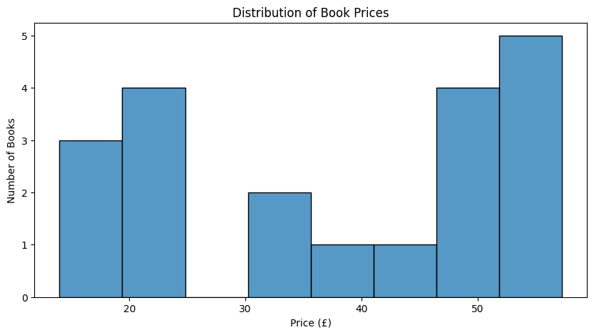
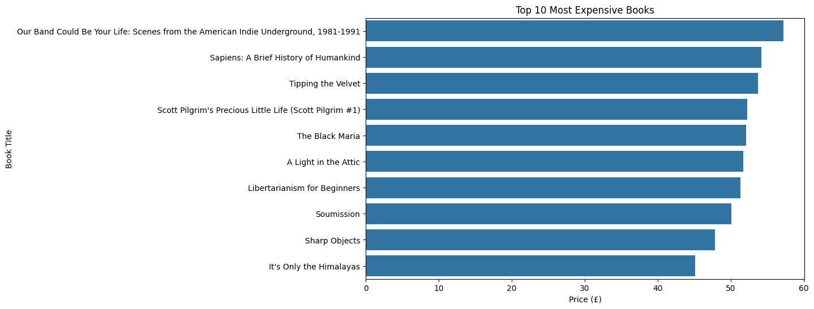

# CodeAlpha Web Scraping, EDA and Data Visualization

## 📌 Project Overview

This project was completed as part of my Data Analytics Internship at CodeAlpha.

The project demonstrates how Python can be used to collect data from a website, clean and analyze the data, and create visualizations to understand the results.

## 🎯 Objectives

- Scrape book information from a public website.
- Create a structured dataset.
- Clean and preprocess the data.
- Perform Exploratory Data Analysis (EDA).
- Identify useful patterns and statistics.
- Create visualizations to present the findings.

## 🛠️ Technologies Used

- Python
- Requests
- BeautifulSoup
- Pandas
- Matplotlib
- Seaborn
- VS Code

## 📊 Tasks Completed

### Task 1: Web Scraping

Book information was collected from:

https://books.toscrape.com/

The following information was extracted:

- Book Title
- Book Price

The scraped data was stored in:

`books_dataset.csv`

### Task 2: Exploratory Data Analysis

The dataset contains:

- 20 books
- 2 columns
- No missing values

The price column was initially stored as text because it contained the `£` symbol. It was cleaned and converted to a numerical format.

### 📈 Key Findings

- Average book price: **£38.05**
- Minimum book price: **£13.99**
- Maximum book price: **£57.25**
- Median book price: **£41.38**

The cheapest book is:

**Starving Hearts (Triangular Trade Trilogy, #1)**

The most expensive book is:

**Our Band Could Be Your Life: Scenes from the American Indie Underground, 1981-1991**

## 📊 Task 3: Data Visualization

The project contains the following visualizations:

1. Distribution of Book Prices
2. Top 10 Most Expensive Books

### Visualization 1



### Visualization 2



## 📁 Project Structure

```text
CodeAlpha_WebScraping_EDA_Visualization
│
├── scraper.py
├── analysis.py
├── visualization.py
├── books_dataset.csv
├── price_distribution.png
├── top_10_expensive_books.png
└── README.md